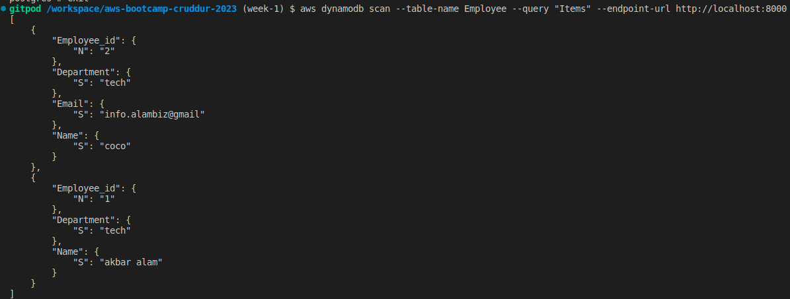

# Week 1 — App Containerization

In containerization week I created docker files for frontend and backend. Learned about how to build docker images. Understands how docker files are created for applications also I come to know about designing API and documenting it.

Week containerization's objective:
* docker containers
* dockerfile and docker compose

## Flask Backend:

created dockerfile for flask backend service. As our backend is written in flask python, I have used python as my base image because it comes with pre-installted python envirnoment and some basic python packages. 

**Docker Container For Backend Service**:
* Build docker image form backend directory
* Run that image on port 4567
* Check for the response from backend api endpoint by append this at the end or url '/api/activities/home'

**Creating docker build from docker file**


**Running the container**


**Hitting the backend URL**


**Response from backend API**


## React Frontend:
Our frontend is written in react which is javascript library, I will be using node as my base image to build containers and the process for build and running the docker image is same as we did for our backend service.

**Docker Container For Backend Service**:
* Build docker image form frontend directory
* Run that image on port 3000
* Chcek if site is up on port 3000 using browser or curl command.

**docker build**


**Load Frontend using browser**


## Docker compose
docker compose is used to create multiple docker container from signle compose file reference to different docker files in pur project. For our use case I can created 4 containers from single docker-compose file with different configuration for each container.


```console
docker-compose up --build
```
**Use this command to run all the containers from our docker compose file.**

**docker compose up:**


## Adding PostgreSQL & Dynamodb local to docker compose:

We will add postgresql and dynamodb as services to our perviously created docker compose file and test if connection and inserting some dummy/test data into the both databases.

**Dynamodb Local**




**postgresql**


## Implementing notification service for backend & frontend

**Backend Notification Response**


**Frontend**


